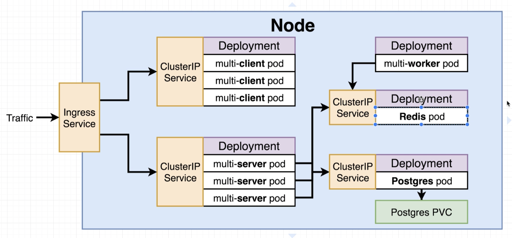
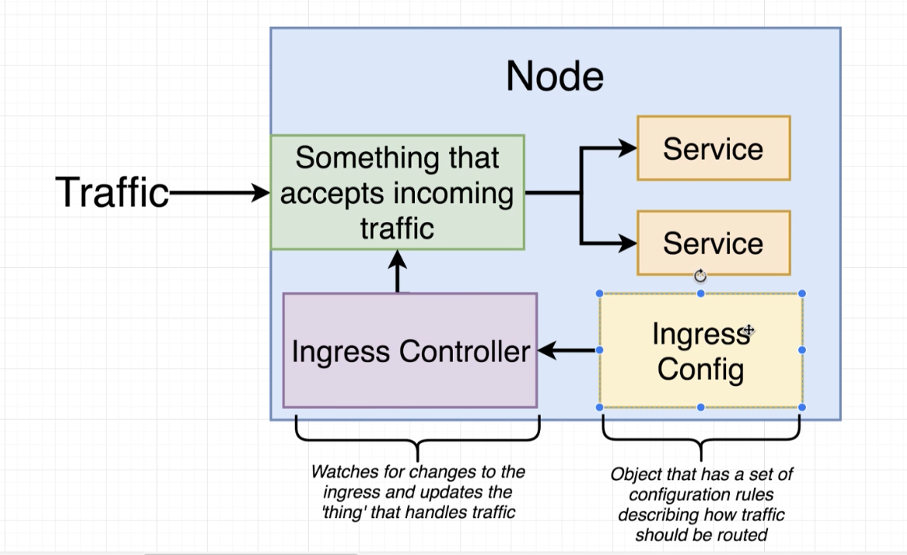
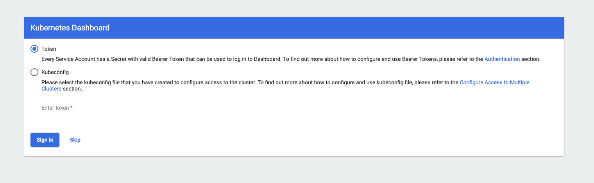
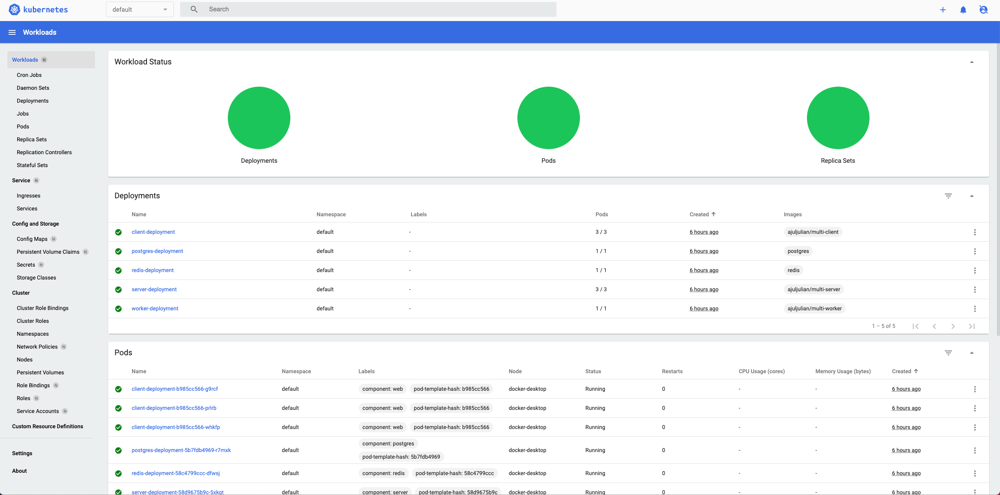

## Node Architecture


## Flow

1. Create config files for each service and deployment
1. Test locally on Docker Kubernetes
1. Create Github/Travis flow to build images and deploy
1. Deploy app to a cloud provider

## Creating config files for each service and deployment

Create `client-deployment.yaml`

Create `client-cluster-ip-service.yaml`
Cluster IP: provides access to anything inside the cluster.

Create `server-deployment.yaml`

Create `server-cluster-ip-service.yaml`

Create `worker-deployment.yaml`

Create `redis-deployment.yaml`

Create `redis-cluster-ip-service.yaml`

Create `postgres-deployment.yaml`

Create `postgres-cluster-ip-service.yaml`

## Volumes and Persistent Volume Claims

If we don't want to lose data if a container crashes, we need to externalize where the container writes its data.

For example, Postgres databases are written to some file system. If the file system is inside the container, then we lose the database if we lose the container.

Solution: create a volume on the host machine, outside of the container.

### Volume vs. Persistent Volume vs. Persistent Volume Claim

A normal Kubernetes volume is tied to a pod.  If the container running inside a pod dies and a new one gets created, we’re good.  But if the pod dies, the volume goes away.  This is why we need to use a `Persistent Volume Claim` and a `Persistent Volume`

With a __Persistent Volume__, the volume is “outside” the pod.  If the pod is re-created, the new pod will just connect to the volume.

__Persistent Volume Claim__ is an advertisement of volume options. If you ask for one of these options, the Kubernetes will either give you a pre-existing one or create one specifically for you if it doesn’t have any.


Create `database-persistent-volume-claim.yaml`

### Persistent Volume Access Modes
1. ReadWriteOnce (can be used by a single node)
1. ReadOnlyMany (multiple nodes can read from this)
1. ReadWriteMany (can be read and written to by many nodes)

Remember to make sure that, in `postgres-deployment.yaml`, you are setting up a volume using this PVC. You need to both allocate the storage and also update the container section to make sure the container has access to the volume.

## Secrets

A `Secret` is a different Kubernetes object type. It is used for storing secrets, for example Postgres passwords.

We need to use an imperative command to pass the secret in.

```
$ kubectl create secret generic pgpassword --from-literal PGPASSWORD=12345asdf 
```


## Load balancing

Note: a load balancer service can only load balance one deployment.  Use Ingress instead.

## Ingress



We create a configuration file (an ingress config), which is a set of routing rules.  We feed into kubectl which creates an Ingress **Controller** inside our Node.  The ingress controller’s job is to look at the routing rules and make it a reality.  The ingress controller will have to create some infrastructure inside our cluster to make the rules work.

This is the Nginx Ingress project we're using:
http://github.com/kubernetes/ingress-nginx

### Setting up Ingress with Docker Desktop:

```
$ kubectl apply -f https://raw.githubusercontent.com/kubernetes/ingress-nginx/controller-v0.45.0/deploy/static/provider/cloud/deploy.yaml
$ kubectl get pods -n ingress-nginx
```

Create `ingress-service.yaml`

## Kubernetes Dashboard

Go to: https://github.com/kubernetes/dashboard#install

Grab the install command. e.g.:
```
$ kubectl apply -f https://raw.githubusercontent.com/kubernetes/dashboard/v2.2.0/aio/deploy/recommended.yaml
```

Copy the url within the command:
```
https://raw.githubusercontent.com/kubernetes/dashboard/v2.2.0/aio/deploy/recommended.yaml
```

Download the config file locally:
```
$ curl https://raw.githubusercontent.com/kubernetes/dashboard/v2.2.0/aio/deploy/recommended.yaml > kubernetes-dashboard.yaml
```

Find `args` and add the following two lines immediately underneath --auth-generate-certificates:

```
args:
            - --auto-generate-certificates
            - --enable-skip-login
            - --disable-settings-authorizer
            - --namespace=kubernetes-dashboard
```

Apply the config:
```
$ kubectl apply -f k8s/kubernetes-dashboard.yaml
```

Start the server:
```
$ kubectl proxy
```

Visit the dashboard at: http://localhost:8001/api/v1/namespaces/kubernetes-dashboard/services/https:kubernetes-dashboard:/proxy/



Skip login



## Commands

Get deployments:
```
$ kubectl get deployments
```

Delete deployment:
```
$ kubectl delete deployment <deployment>
```

Apply deployment:
```
$ kubectl apply -f <deployment>
```

Apply multiple deployments:
```
$ kubectl apply -f <deployments directory>
```

Get services:
```
$ kubectl get services
```

Delete service:
```
$ kubectl delete service <service>
```

Getting logs from pod:
```
$ kubectl logs <pod>
```

See storage classes:
```
$ kubectl get storageclass
```

See persistent volumes:
```
$ kubectl get pv
```

See persistent volume claims:
```
$ kubectl get pvd
```

See secrets:
```
$ kubectl get secrets
```

Delete secret:
```
$ kubectl delete secret <secret>
```