# Overview

Example React app using multiple Docker containers and using Kubernetes for orchestration etc.

The system can be deployed locally on docker-desktop, or on Google Kubernetes Engine (among others)

This is based on the following Udemy course: https://www.udemy.com/course/docker-and-kubernetes-the-complete-guide/

For storage, we're making use of Postgres and Redis.

## App architecture

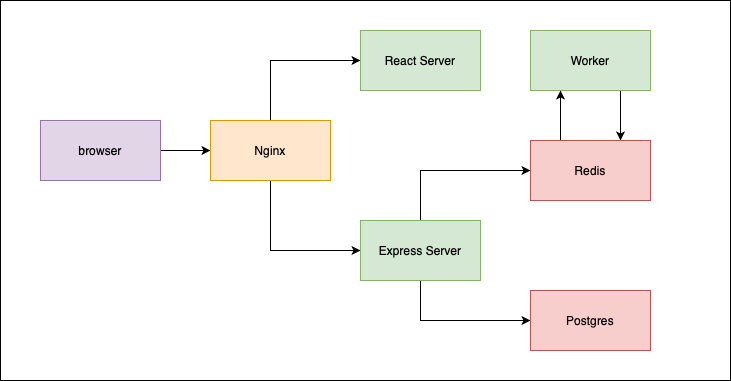

1. Nginx
1. React server
1. Express server
1. Worker
1. Redis
1. Postgres

## App flow

1. User submits a number
1. React app sends number to Express server
1. Express server stores number in Postgres database
1. Express server puts number in Redis
1. Worker listens to Redis insert events, calculates the Fibonacci value recursively (slow), and puts it back in Redis

# Local Deployment

```
$ kubectl apply -f k8s -f k8s.dev
```

In a web browser, navigate to `http://localhost`


# Development

## Node Architecture
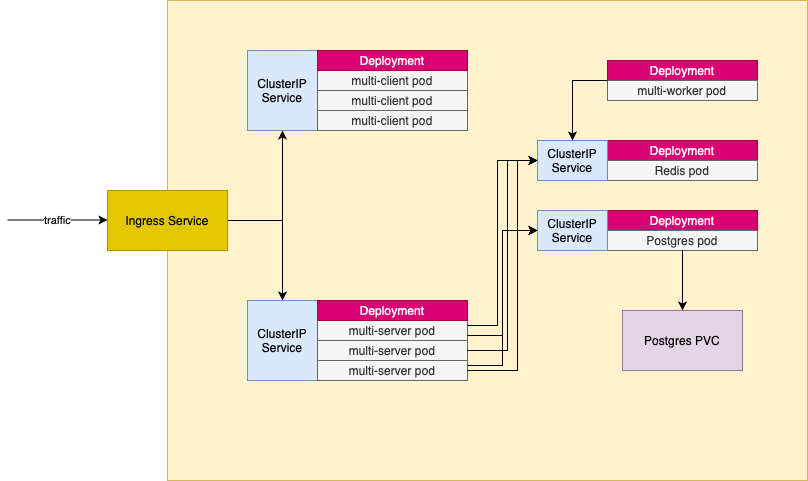

## Flow

1. Create config files for each service and deployment
1. Test locally on docker-kubernetes
1. Create Github/Travis flow to build images and deploy
1. Deploy app to a cloud provider

## Creating config files for each service and deployment

Create `client-deployment.yaml`

Create `client-cluster-ip-service.yaml`
Cluster IP: provides access to anything inside the cluster.

Create `server-deployment.yaml`

Create `server-cluster-ip-service.yaml`

Create `worker-deployment.yaml`

Create `redis-deployment.yaml`

Create `redis-cluster-ip-service.yaml`

Create `postgres-deployment.yaml`

Create `postgres-cluster-ip-service.yaml`

## Volumes and Persistent Volume Claims

If we don't want to lose data if a container crashes, we need to externalize where the container writes its data.

For example, Postgres databases are written to some file system. If the file system is inside the container, then we lose the database if we lose the container.

Solution: create a volume on the host machine, outside of the container.

### Volume vs. Persistent Volume vs. Persistent Volume Claim

A normal Kubernetes volume is tied to a pod.  If the container running inside a pod dies and a new one gets created, we’re good.  But if the pod dies, the volume goes away.  This is why we need to use a `Persistent Volume Claim` and a `Persistent Volume`

With a __Persistent Volume__, the volume is “outside” the pod.  If the pod is re-created, the new pod will just connect to the volume.

__Persistent Volume Claim__ is an advertisement of volume options. If you ask for one of these options, the Kubernetes will either give you a pre-existing one or create one specifically for you if it doesn’t have any.


Create `database-persistent-volume-claim.yaml`

### Persistent Volume Access Modes
1. ReadWriteOnce (can be used by a single node)
1. ReadOnlyMany (multiple nodes can read from this)
1. ReadWriteMany (can be read and written to by many nodes)

Remember to make sure that, in `postgres-deployment.yaml`, you are setting up a volume using this PVC. You need to both allocate the storage and also update the container section to make sure the container has access to the volume.

## Secrets

A `Secret` is a different Kubernetes object type. It is used for storing secrets, for example Postgres passwords.

We need to use an imperative command to pass the secret in.

```
$ kubectl create secret generic pgpassword --from-literal PGPASSWORD=12345asdf 
```


## Load balancing

Note: a load balancer service can only load balance one deployment.  Use Ingress instead.

## Ingress

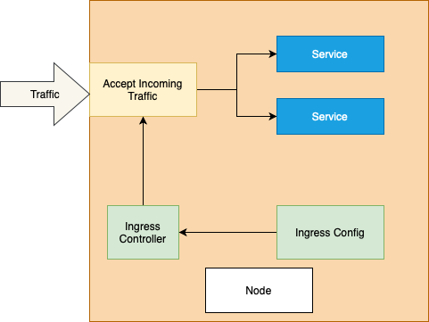

We create a configuration file (an ingress config), which is a set of routing rules.  We feed into kubectl which creates an Ingress **Controller** inside our Node.  The ingress controller’s job is to look at the routing rules and make it a reality.  The ingress controller will have to create some infrastructure inside our cluster to make the rules work.

This is the Nginx Ingress project we're using:
http://github.com/kubernetes/ingress-nginx

### Setting up Ingress with docker-desktop:

```
$ kubectl apply -f https://raw.githubusercontent.com/kubernetes/ingress-nginx/controller-v0.45.0/deploy/static/provider/cloud/deploy.yaml
$ kubectl get pods -n ingress-nginx
```

Create `ingress-service.yaml`

## Kubernetes Dashboard

Go to: https://github.com/kubernetes/dashboard#install

Grab the install command. e.g.:
```
$ kubectl apply -f https://raw.githubusercontent.com/kubernetes/dashboard/v2.2.0/aio/deploy/recommended.yaml
```

Copy the url within the command:
```
https://raw.githubusercontent.com/kubernetes/dashboard/v2.2.0/aio/deploy/recommended.yaml
```

Download the config file locally:
```
$ curl https://raw.githubusercontent.com/kubernetes/dashboard/v2.2.0/aio/deploy/recommended.yaml > kubernetes-dashboard.yaml
```

Find `args` and add the following two lines immediately underneath --auth-generate-certificates:

```
args:
            - --auto-generate-certificates
            - --enable-skip-login
            - --disable-settings-authorizer
            - --namespace=kubernetes-dashboard
```

Apply the config:
```
$ kubectl apply -f k8s/kubernetes-dashboard.yaml
```

Start the server:
```
$ kubectl proxy
```

Visit the dashboard at: http://localhost:8001/api/v1/namespaces/kubernetes-dashboard/services/https:kubernetes-dashboard:/proxy/


Skip login


# Deployment to Google Kubernetes Engine

Connect Github project to Travis

Go to: https://console.cloud.google.com

Create new project

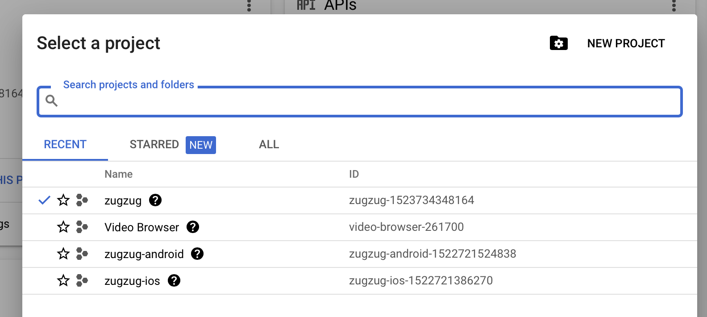

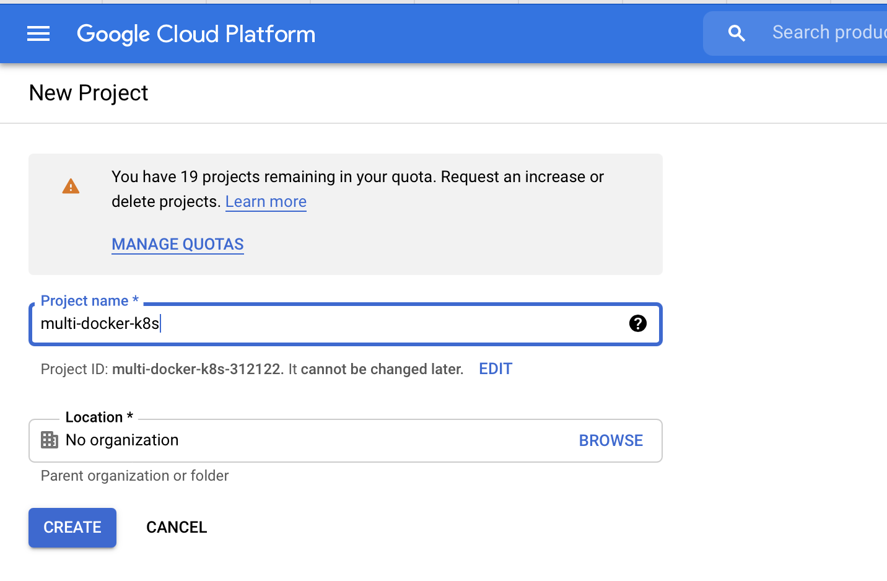

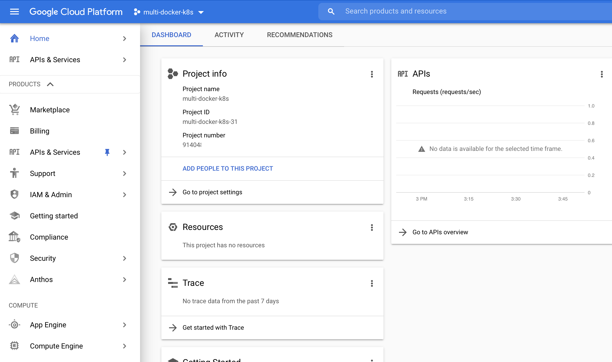

Make sure you have billing enabled

Create a cluster

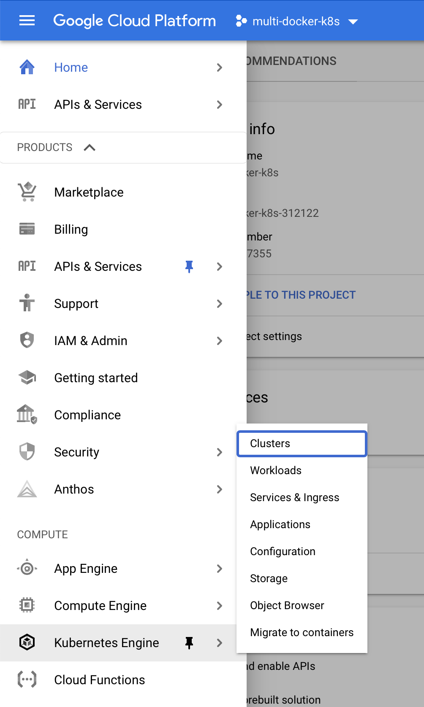

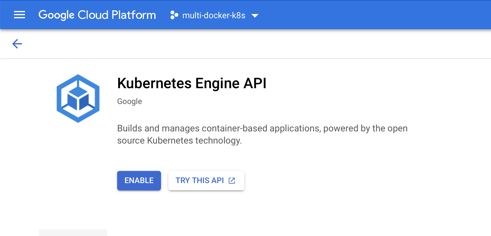

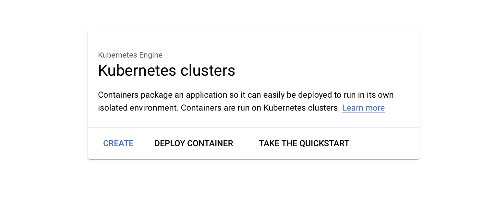

Create `.travis.yml` file

Note: in order for travis to talk to GKE, we need to create an IAM account on Google.

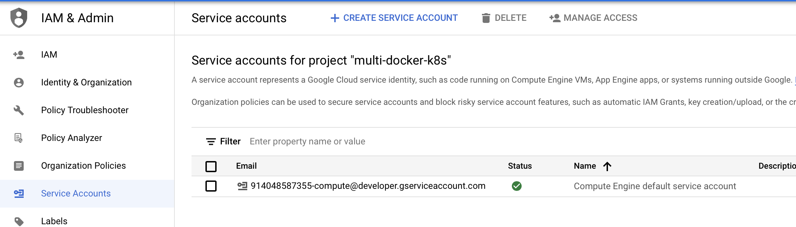

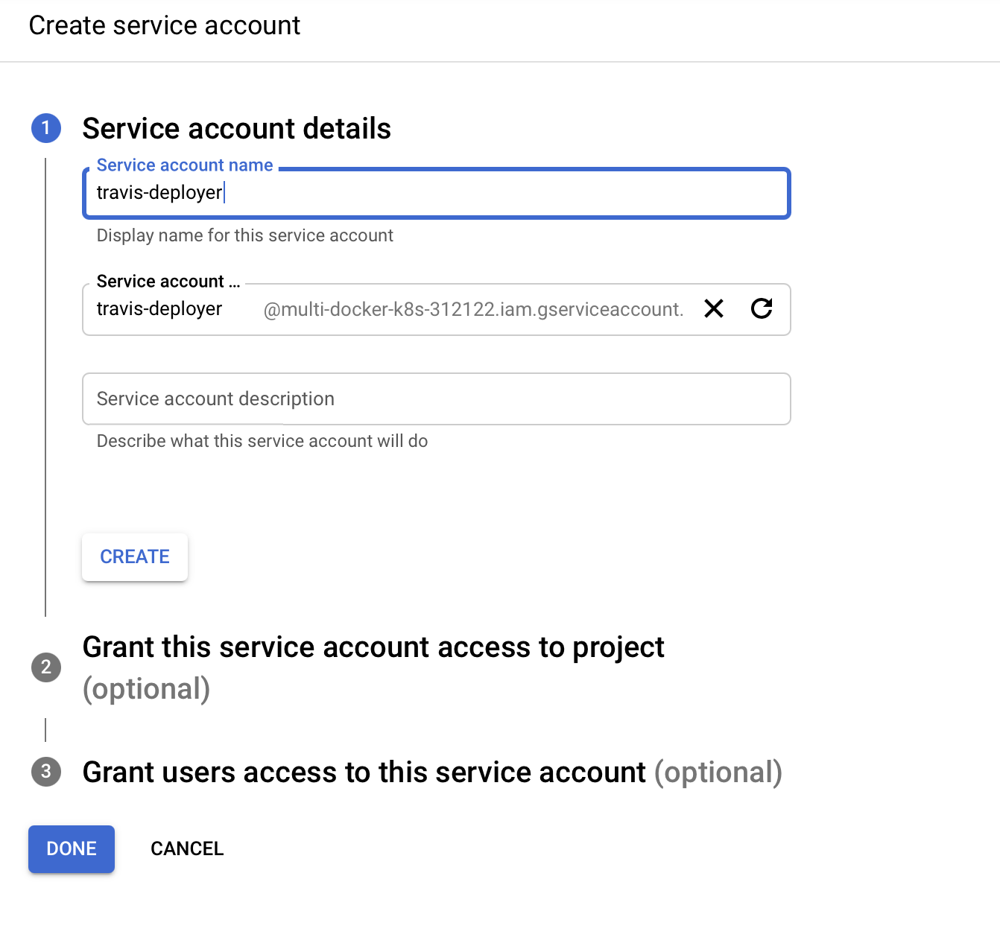

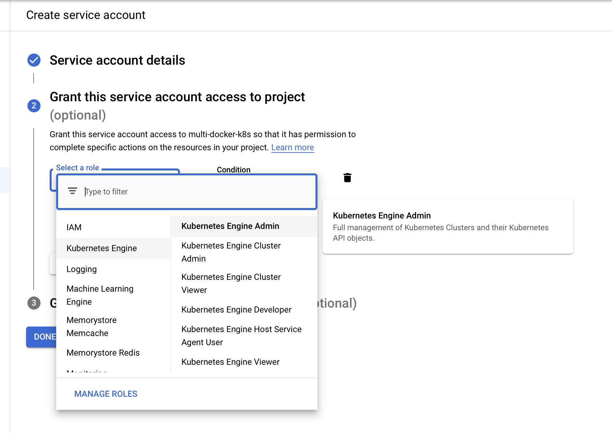

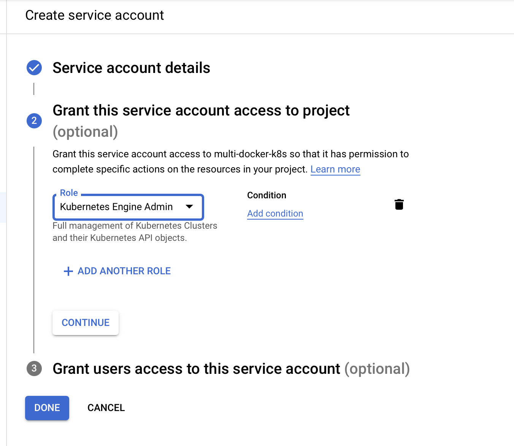

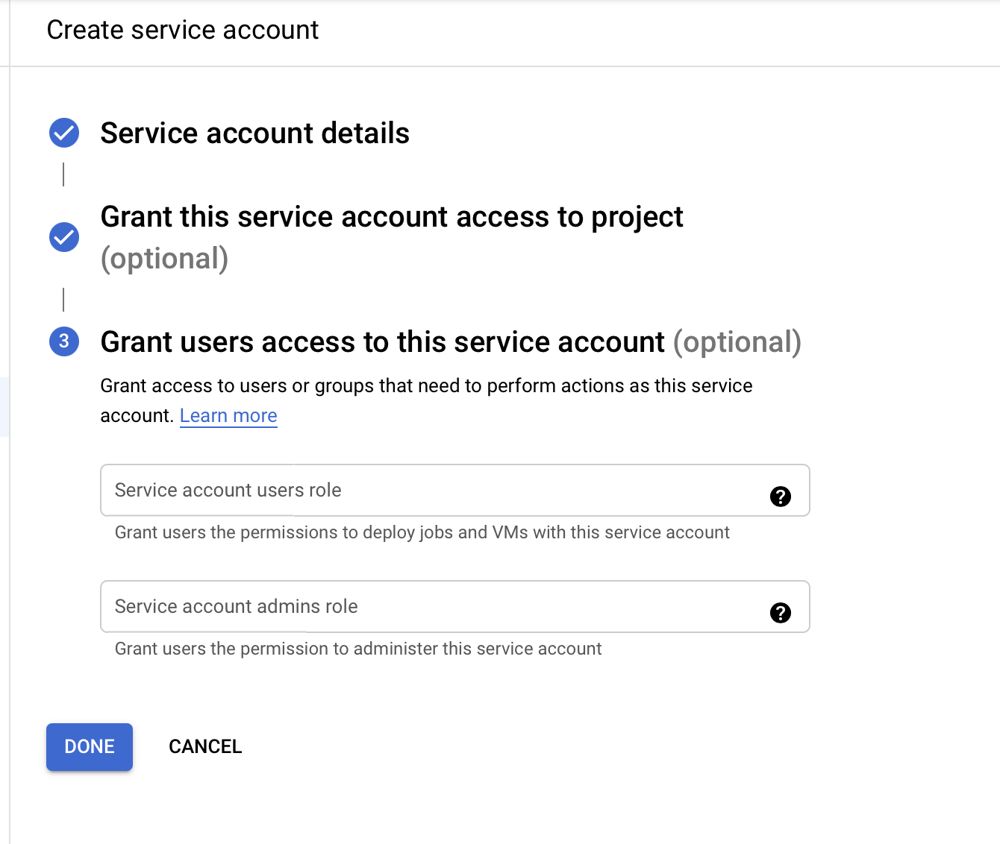

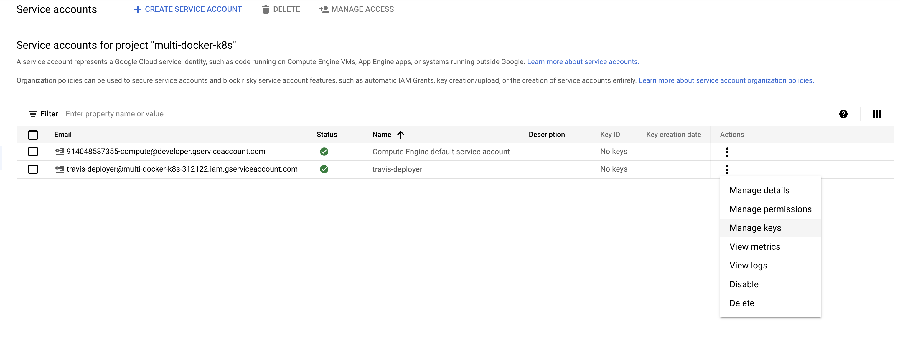

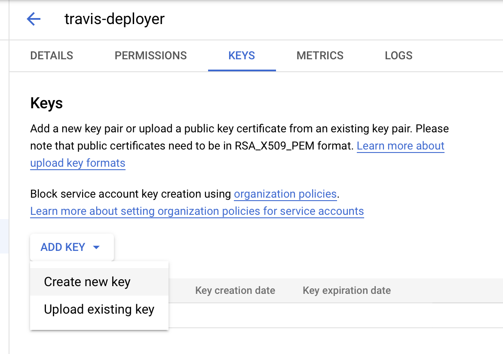

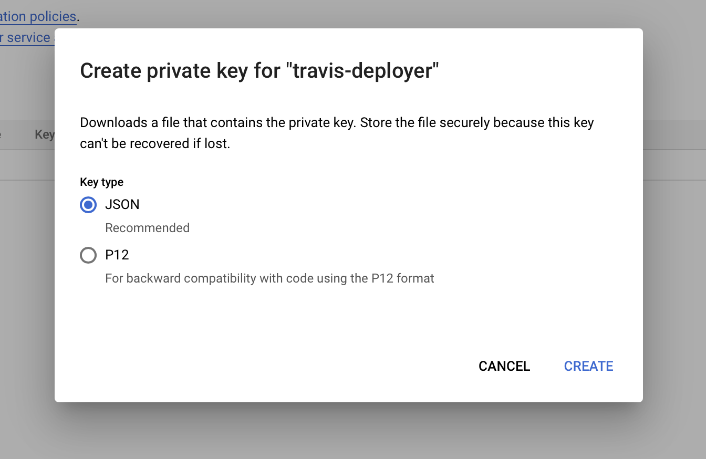

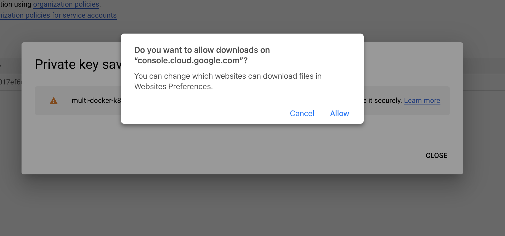


After you download the credentials json file from Google, you need to use the travis CLI to encrypt it. The best way to do this consistently is to use a docker container with the ruby image.

Note: you need to create a Github Personal Access Token for Travis and use it to log in to Travis with.

```
$ docker run -it -v $(pwd):/app ruby:2.4 sh
# gem install travis
# travis
# travis login --github-token <github personal token> --com
# travis encrypt-file service-account.json -r ajuljulian/multi-docker-k8s --com
# exit
```

IMPORTANT: Once you have encypted the google credentials file (`service-account.json.enc`), **delete** the original unencrypted file (`service-account.json`)

Make sure that you've specified the `DOCKER_USERNAME` and `DOCKER_PASSWORD` environment variables in the Travis settings for the project.

`.travis.yaml` invokes a shell script, `deploy.sh` to handle the deployment of the containers to Docker hub.  We have to deploy two versions, one tagged with the commit SHA so that k8s re-deploys, and another one tagged with `latest` so that people applying the cluster get the latest version.

We also need to run an imperative command to create a secret on the GKE cluster.  For that, we can lever Google's Kubernetes Cloud Shell feature.

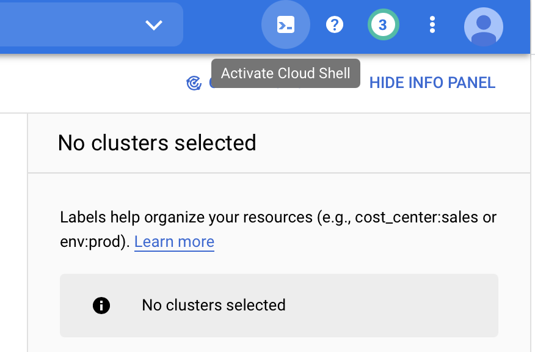

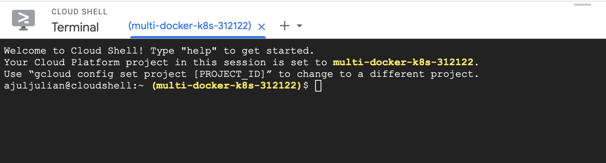

We need to run a bunch of commands in this shell:

```
$ gcloud config set project multi-docker-k8s-312122
$ gcloud config set compute/zone us-west1-a
$ gcloud container clusters get-credentials multi-cluster
```

```
$ kubectl create secret generic pgpassword --from-literal PGPASSWORD=some_password
```

We also need to install nginx kubernetes into our cluster. We can use Helm for that.

https://kubernetes.github.io/ingress-nginx/deploy/#using-helm

In our Google Cloud Console, we need to issue these commands:
```
$ curl -fsSL -o get_helm.sh https://raw.githubusercontent.com/helm/helm/master/scripts/get-helm-3
$ chmod 700 get_helm.sh
./get_helm.sh
```

Install Ingress-Nginx:
```
$ helm repo add ingress-nginx https://kubernetes.github.io/ingress-nginx
$ helm install ingress-nginx ingress-nginx/ingress-nginx
```

# Setting up https

We'll use LetsEncrypt (https://letsencrypt.org)

### Flow
1. Kubernetes cluster tells LetsEncrypt that it owns a given domain and asks for a certificate
1. LetsEncrypt makes a request to that domain and expects a specific reply
1. LetsEncrypt issues a certificate that's good for 90 days

Point your domain to the IP address exposed by your cluster
A record -> IP
www CNAME -> @

We're using the "Cert Manager" project to facilitate getting the cert: https://github.com/jetstack/cert-manager

In order to install Cert Manager, do the following in the GCP Cloud Shell:
```
$ kubectl create namespace cert-manager
$ helm repo add jetstack https://charts.jetstack.io
$ helm repo update
$ helm install \
  cert-manager jetstack/cert-manager \
  --namespace cert-manager \
  --version v1.2.0 \
  --create-namespace
$ kubectl apply -f https://github.com/jetstack/cert-manager/releases/download/v1.2.0/cert-manager.crds.yaml
```

It uses two Kubernetes objects configured using config files:
1. Issuer: object that tells the Cert Manager where to get the certificate from
1. Certificate: object that describes the certificate details


Create `issuer.yaml`

Create `certificate.yaml`

Deploy to GKE.  It should create the new objects.

In GCP Cloud Shell, try to get the certificate and describe them
```
$ kubectl get certificates
# kubectl describe certificates
```

uninstalling cert manager:

```
$ helm --namespace cert-manager delete cert-manager
$ kubectl delete namespace cert-manager
$ kubectl delete -f https://github.com/jetstack/cert-manager/releases/download/v1.2.0/cert-manager.crds.yaml
```

# Local Development Using Skaffold

https://skaffold.dev/docs/install/

## Install using homebrew

```
$ brew install skaffold
$ skaffold version
```

Create `skaffold.yaml`

Start (see section about local development and https):
```
$ skaffold dev
```

## Local development and https

Problem: after creating `certificate.yaml` and `issuer.yaml` and updating `ingress-service.yaml` to make https work on Google Cloud, local deployments started failing, including running through skaffold.

I divided the deployment yaml file into 3 directories: `k8s`, `k8s.dev`, and `k8s.prod`.
I modified `skaffold.yaml` like this:
```
deploy:
  kubectl:
    manifests:
      - ./k8s/*
      - ./k8s.dev/*
```

As a result, I am able to run locally through skaffold:
```
$ skaffold dev
```

Or directly:
```
$ kubectl apply -f k8s -f k8s.dev
```

# Commands

Get deployments:
```
$ kubectl get deployments
```

Delete deployment:
```
$ kubectl delete deployment <deployment>
```

Apply deployment:
```
$ kubectl apply -f <deployment>
```

Apply multiple deployments:
```
$ kubectl apply -f <deployments directory>
```

Get services:
```
$ kubectl get services
```

Delete service:
```
$ kubectl delete service <service>
```

Getting logs from pod:
```
$ kubectl logs <pod>
```

See storage classes:
```
$ kubectl get storageclass
```

See persistent volumes:
```
$ kubectl get pv
```

See persistent volume claims:
```
$ kubectl get pvd
```

See secrets:
```
$ kubectl get secrets
```

Delete secret:
```
$ kubectl delete secret <secret>
```